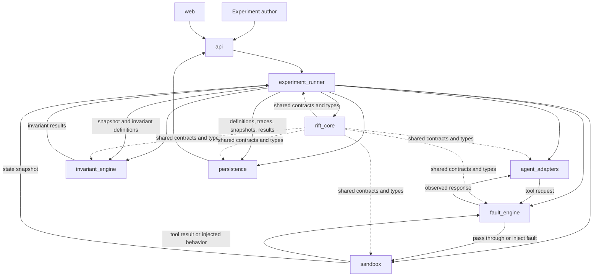

# Architecture

## Architectural objectives

RIFT is organized around a framework-agnostic experiment engine. Agent execution, mutable test environments, invariant evaluation, storage, and delivery mechanisms are separate boundaries. Dependencies point toward contracts and domain types in `rift_core`; the core does not import infrastructure or framework adapters.

The first implementation should be a local in-process vertical slice. Process boundaries, queues, distributed scheduling, and durable workflows are deferred.

## Major components and data flow



In a local run, these are logical module boundaries within one process. The diagram does not imply separately deployed services.

## Component responsibilities

### `rift_core`

Owns stable domain concepts and framework-neutral contracts. It may define typed identifiers, experiment/run models, fault and invocation records, result models, and protocol-style interfaces shared across components. It contains no FastAPI, SQLAlchemy, OpenAI SDK, Next.js, or sandbox implementation dependencies.

### `fault_engine`

Compiles `FaultRule` definitions into a deterministic fault plan and intercepts tool invocations. It decides whether a rule matches, uses a seeded random source where probability or selection is required, applies the selected `FaultType`, and records what happened. It does not decide whether the overall business outcome is correct.

Faults are applied at the tool/dependency boundary so an adapter need not understand fault mechanics. Some fault types require distinct phases: a timeout before execution suppresses the underlying operation, while a timeout after commit permits it and changes only the observed response.

### `experiment_runner`

Coordinates the lifecycle of an experiment. It resets the environment, executes baseline and faulted runs, requests snapshots, invokes invariant evaluation, persists artifacts, and constructs the baseline comparison. It owns sequencing, not business-tool implementation, adapter internals, or invariant logic.

### `agent_adapters`

Contains implementations of the `AgentAdapter` contract. An adapter accepts a scenario execution context, exposes or binds sandbox tools in the form required by its framework, runs the agent, and returns framework-neutral execution data. The first adapter will be `ScriptedAgentAdapter`; an OpenAI Agents SDK adapter is a future integration.

Framework dependencies are permitted inside their adapter packages only.

### `sandbox`

Provides an isolated, resettable environment for a scenario. It owns test-domain state, tool implementations, reset/seed behavior, and snapshot production. A sandbox models observable external systems; it is not a general security sandbox for executing untrusted code.

### `invariant_engine`

Evaluates declared `Invariant` objects against a `StateSnapshot` and run evidence. It emits structured `InvariantResult` values with status and evidence. It does not use an agent's final text as proof that an external operation succeeded.

### `persistence`

Defines repositories for experiment definitions, runs, invocations, snapshots, and results, plus concrete storage implementations. Early implementations may be in-memory or local. SQLAlchemy and PostgreSQL can be introduced behind these interfaces when required.

### `api`

Exposes application operations through FastAPI. It validates transport data, invokes application services, and maps results to HTTP responses. It must not contain orchestration, fault-selection, or invariant-evaluation logic.

### `web`

Provides the Next.js and TypeScript interface for defining experiments and inspecting runs. It communicates through the API and owns no authoritative experiment state or evaluation logic.

## Dependency rules

1. `rift_core` has no dependency on the other listed components.
2. `fault_engine`, `agent_adapters`, `sandbox`, and `invariant_engine` depend on core contracts, not on each other's concrete implementations.
3. `experiment_runner` composes contracts through dependency injection.
4. `persistence` implementations depend on core models and persistence interfaces; domain logic does not depend on SQLAlchemy models.
5. `api` depends on application services exposed by the runner and persistence boundaries.
6. `web` depends on the HTTP contract only.
7. Provider-specific SDK types do not cross the adapter boundary.

## Conceptual execution flow

```text
Experiment Definition
        ↓
Environment Reset
        ↓
Baseline Run
        ↓
State Snapshot
        ↓
Invariant Evaluation
        ↓
Environment Reset
        ↓
Faulted Run
        ↓
State Snapshot
        ↓
Invariant Evaluation
        ↓
Baseline vs Fault Comparison
```

The baseline and faulted runs are separate `ExperimentRun` instances. Both derive from the same `Scenario` and equivalent initial sandbox state. The baseline has no active fault rules; the faulted run has a deterministic plan derived from the experiment's rules and seed. Each run retains its own tool-invocation trace, state snapshot, invariant results, and terminal result.

The first vertical slice may execute one faulted run per experiment. The model should allow later expansion to multiple seeds or fault plans without requiring distributed execution.

## Determinism

Determinism applies to RIFT-controlled behavior:

- A run records the experiment definition version, scenario version, adapter identity, seed, and active fault plan.
- Random decisions come from a run-scoped seeded generator, not process-global randomness.
- Rule evaluation order and invocation indexing are stable and explicit.
- Environment reset reconstructs equivalent initial state for baseline and faulted runs.
- Times and generated identifiers used in deterministic tests are supplied through injectable clocks and ID sources where behavior depends on them.

External model providers may remain nondeterministic. Such nondeterminism must not alter which configured faults RIFT selects for an otherwise identical invocation trace.

## Invocation interception model

Every sandbox tool call produces a `ToolInvocation` record with a stable run-local sequence number. The fault engine evaluates ordered rules against metadata such as tool name, invocation occurrence, and run mode. It then chooses one of three broad behaviors:

1. Execute the operation and return its normal response.
2. Do not execute the operation and return or raise the injected failure.
3. Execute the operation, then alter the caller-visible result (for example, timeout after commit or malformed response).

The trace records matching rules, the selected fault, whether the underlying operation executed or committed when knowable, timing, and the caller-visible outcome. Sensitive values should be redacted before persistence.

## State and evaluation

A `StateSnapshot` is an immutable observation of scenario-relevant state at a defined point. Invariants are evaluated after a run completes or terminates. An agent's text output may be retained as diagnostic evidence but cannot substitute for state verification.

Baseline comparison answers both:

- Did the faulted run satisfy its required invariants?
- How did its outcomes and side effects differ from the baseline?

A baseline failure invalidates or errors the comparison because it does not provide a valid control outcome. Exact comparison semantics will be specified with the core engine rather than assumed in this blueprint.

## Persistence and observability

Persistence stores durable product records. Observability describes diagnostic signals such as structured events, traces, metrics, and exporter integrations. They are separate concerns even when both consume the same run events.

The local core should emit structured, framework-neutral lifecycle events. OpenTelemetry instrumentation and an optional Langfuse exporter are deferred to V3. Persistence may begin in memory and later use SQLAlchemy/PostgreSQL without changing the domain contracts.

## Deployment evolution

- V0 and V1: local, in-process runner and deterministic sandbox.
- V2: FastAPI backend, Next.js frontend, and persistent database.
- V3: standard telemetry and optional exporters.
- V4: Temporal-based durable orchestration, only after local semantics are stable.

Temporal must coordinate the existing application operations rather than move fault or invariant logic into workflow definitions.

## Security considerations

The initial system targets synthetic local environments, not production systems. Future integrations must treat tool inputs, outputs, traces, and snapshots as potentially sensitive. Provider credentials belong in runtime secret storage, never experiment definitions, logs, fixtures, or source control. Executing untrusted agent code is outside the initial sandbox's security guarantees.

